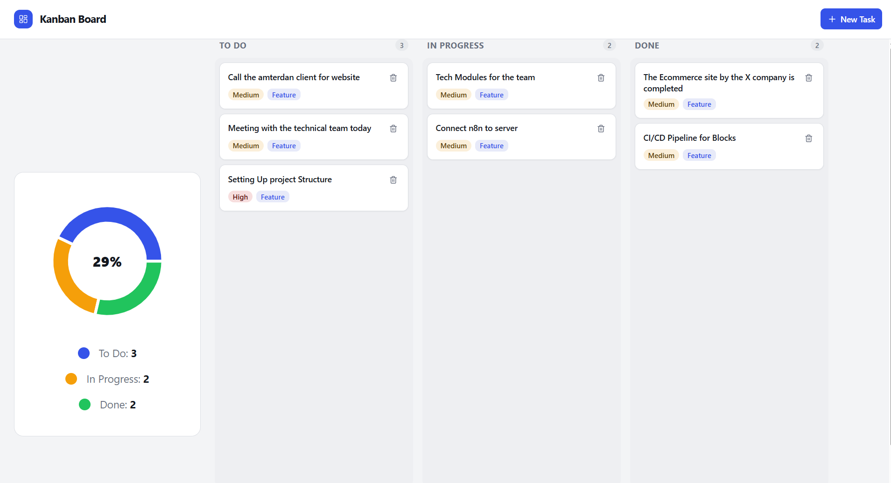

# 🛠 Project Process Summary

This document summarizes the steps completed during the development of the WebSocket Kanban Board project.

## 2. Backend Setup
- Implemented Express server with Socket.IO for real-time WebSocket communication.
- Created REST routes for task management.
- Supported WebSocket events: `task:create`, `task:update`, `task:move`, `task:delete`, `sync:tasks`.
- Used in-memory storage for tasks (MongoDB).

## 3. Frontend Setup
- Built Kanban board UI in React with columns: To Do, In Progress, Done.
- Added drag-and-drop functionality for tasks.
- Integrated WebSocket client for real-time updates.
- Implemented loading indicators and state sync.

## 4. Feature Implementation
- Task creation, update, deletion, and movement between columns.
- Priority and category selection via dropdowns.
- File upload for task attachments with image preview.
- Progress chart showing task counts and completion percentage.

## 5. Testing
- Unit tests for core functions (add, update, delete tasks, WebSocket logic) using Vitest.
- Integration tests for state sync and drag-and-drop.
- End-to-end tests with Playwright for user flows: task creation, movement, deletion, dropdowns, file upload, and chart updates.

## 6. Code Quality & Documentation
- Applied best practices for React component structure and separation of concerns.
- Documented code and project structure.

## 7. Final Verification
- Verified real-time updates across multiple clients.
- Ensured all tests pass and UI is responsive.

---

## ✅ Outcome
- Fully functional real-time Kanban board with robust testing and documentation.
- Ready for deployment and further enhancements.

---

